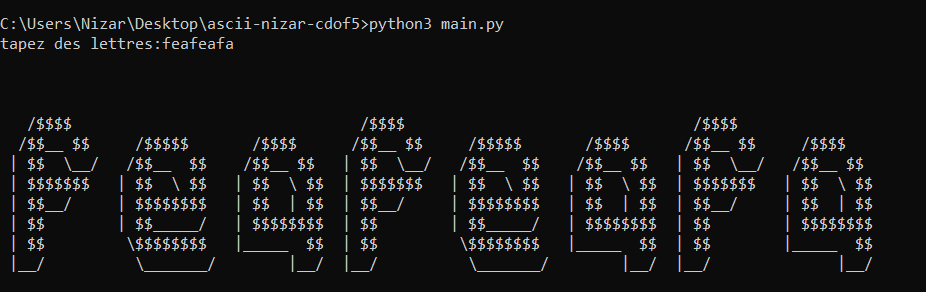

# ascii-nizar-cdof5

This project aims to transform yout input in the console to an ASCII art text.

## Features
- ASCII library, text to ascii art (not finished yet)
- Console application

## How to run the project
```
git clone https://github.com/Onizaro/ascii-nizar-cdof5.git
cd ascii-nizar-cdof5
python3 main.py
```

It should look like this:


## To do

If it's possible, it would be great to transform our ASCII art text to an image

## Contributors

- Coraz0nn
- Elbayly-Amir